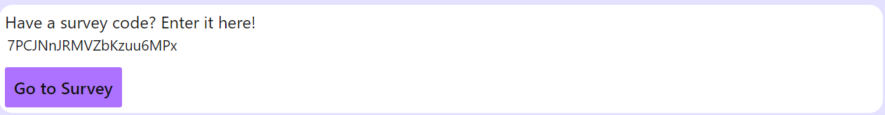
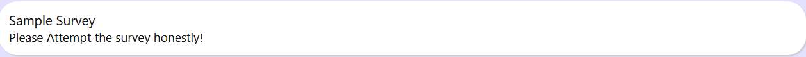
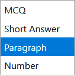
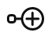

# Surveyor

A Survey App for students and teachers built with Svelte and Firebase for the Timathon Code Jam

Website Link: https://surveyor-svelte.web.app

## How to run?

> Note: Make sure you have NodeJS installed in your system

1. Clone this repo: `git clone https://github.com/DevHyperCoder/Surveyor-Timathon`
2. Install the required packages with `npm install` or `yarn`
3. Run the app using `npm dev` or `yarn dev`
4. Visit http://localhost:5000/ and enjoy the site :)

## Firebase Notes:

No credentials are required for firebase

## Features:

All features of Surveyor App are listed below
Detailed list of all the features can be seen though the `Features` tab OR by visiting [this link](https://surveyor-svelte.web.app/features)

### Attempt Survey

If you have a survey code then enter it in the box and then attempt the survey. If you are not logged in then you would be also prompted to enter your name.

### Create a new Survey

Click the `New` button on the Navbar (once you sign in) or go to [this link](https://surveyor-svelte.web.app/new) to create a new survey

Enter the `Survey Title` and the `Survey Description` as shown below

Add a new question by clicking the `+` button. Fill out the question text and choose the question type from the dropdown menu.

Uncheck the checkbox if the question is not required

Click the `Delete` button to delete the question

For MCQ questions, click the icon to add new options. You can edit the text of the options as well.

Share the survey code (or the link) with other students for them to attempt the survey.

### Survey Responses

Go to your dashboard (only for logged in users. ) ie, the homepage link. Click on the survey that you wish to see the responses of. if the survey is not shown, then click on `Show all surveys`.

Once clicked, you can click the `See responses` button.

Names of the attendees would appear. 

Click a survey repondent and then view their responses!

### Templates

When you are logged in, when viewing a survey, click the `document` icon to add it to your surveys.
Visit the templates by clicking on `Your Templates` on the Navbar.

Click `Use template` on the survey you want to use. Once the contents are copied over, click on go to survey. You can edit the contents of this new survey and share with other students as well
